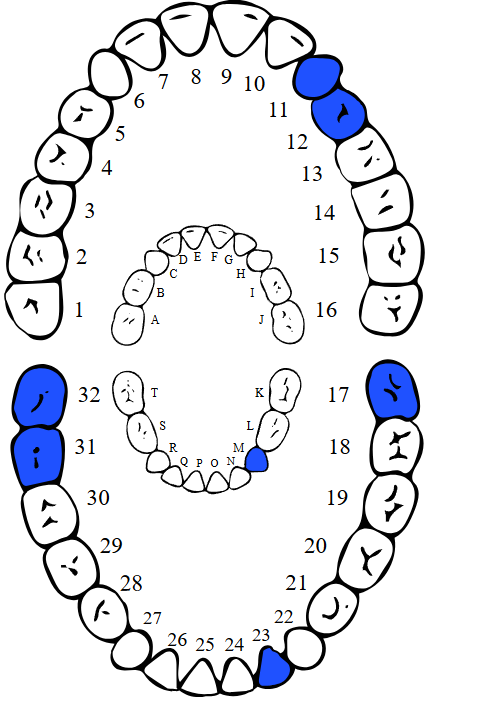

# Code for an upwork test

A dental project. 

Task is to modify svg on server side with PHP.
THe SVG itself represents 'teeth'. From what I have understood the Doc will want to mark some teeth.

### Usage

Since we are using querypath library we will need to install it. 
This will require composer to be installed.
```bash
composer install
php runScript.php
```

The input html file is `htmls/teethPage.html`

In the runScript, we can modify the teeth we want to highlight
`$teethMarker->markTeeth(['32','31','M','11','12','23','17']);`


Output html will be `htmls/teethPageOut.html`
Screenshot of the generated file


